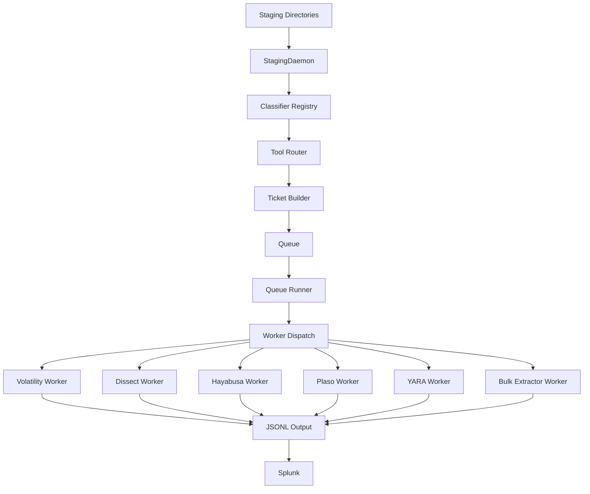

# WADE — Wide-Area Data Extraction

*A modular DFIR automation framework for staging, routing, and processing forensic artifacts at scale—built for austere ops, friendly to Splunk, and designed for real-world incident response.*

[](https://opensource.org/licenses/MIT)

---

## 🎯 Overview

WADE is a comprehensive forensic artifact processing pipeline that automatically:
- **Classifies** incoming evidence (E01, memory dumps, VM images, disk images, network configs)
- **Routes** artifacts through appropriate forensic tools (Volatility, Dissect, Hayabusa, Plaso, YARA, Bulk Extractor)
- **Enriches** data with metadata, host context, and case information
- **Outputs** normalized JSONL for Splunk ingestion and analysis

### Key Features

✅ **Idempotent & Auditable** — Deterministic installs, per-file JSON event logs, SQLite-backed deduplication  
✅ **Modular Architecture** — Independent classifiers, workers, and routing engine  
✅ **Configuration-Driven** — YAML + environment variables for flexible tool selection  
✅ **Online or Offline** — Works with pinned packages; air-gapped operation ready  
✅ **Ops-Friendly** — systemd units, logrotate policies, comprehensive logging  
✅ **Splunk-Native** — Direct integration with Splunk forwarders and indexes

---

## 🏗️ Architecture



### Core Components

1.  [Staging Daemon](https://github.com/imcconnell15/WADE/pull/staging/) --- File classification, metadata extraction, ticket generation
2.  [Worker Framework](https://github.com/imcconnell15/WADE/pull/wade_workers/) --- Tool execution engine with unified ticket schema
3.  [Configuration System](https://github.com/imcconnell15/WADE/pull/etc/) --- Centralized YAML and environment-based config
4.  [Splunk Integration](https://github.com/imcconnell15/WADE/pull/splunkapp/) --- Index definitions, props/transforms, dashboards
5.  [YARA Rules](https://github.com/imcconnell15/WADE/pull/yara/) --- Malware detection and IOC scanning

* * * * *

🚀 Quick Start
--------------

### Prerequisites

-   Ubuntu 20.04+ or RHEL 8+ (Linux-first; Windows worker support planned)
-   Python 3.8+
-   Forensic tools: Volatility3, Dissect, Plaso, Hayabusa, YARA, Bulk Extractor (installed via `install.sh`)
-   Splunk Universal Forwarder (optional, for data forwarding)

### Installation

```source-shell
# Clone the repository
git clone https://github.com/imcconnell15/WADE.git
cd WADE

# Run the idempotent installer (bootstrap + config + services)
sudo -E bash ./install.sh

# Verify services
sudo systemctl status wade-staging.service
sudo systemctl status wade-queue@autopsy.service
```

The installer will:

-   Create user/group (`autopsy` by default)
-   Install dependencies and forensic tools
-   Deploy configuration to `/etc/wade/`
-   Set up systemd services
-   Configure logrotate policies
-   Create directory structure under `/home/autopsy/`

* * * * *

📂 Repository Structure
-----------------------

```
WADE/
├── staging/              # Staging daemon and classifiers
│   ├── classifiers/      # E01, Memory, Disk, VM, Network, Misc
│   ├── config.py         # Environment-driven configuration
│   ├── db.py             # SQLite deduplication tracking
│   ├── file_ops.py       # File I/O utilities (read head/tail, entropy, text detection)
│   ├── path_resolver.py  # Destination path construction
│   ├── stage_daemon.py   # Main orchestrator
│   ├── ticket_builder.py # Ticket generation
│   └── tool_routing.py   # Tool selection engine
├── wade_workers/         # Worker framework
│   ├── bin/              # Queue runner and utilities
│   ├── wade_workers/     # Worker implementations
│   │   ├── bulkextractor_worker.py
│   │   ├── dissect_worker.py
│   │   ├── hayabusa_worker.py
│   │   ├── plaso_worker.py
│   │   ├── volatility_worker.py
│   │   ├── yara_worker.py
│   │   ├── hashing.py           # Multi-strategy content hashing
│   │   ├── logging.py           # Unified event logging
│   │   ├── module_config.py     # YAML+ENV config loader
│   │   ├── subprocess_utils.py  # Tool discovery and execution
│   │   └── ticket_schema.py     # Canonical ticket format
│   └── systemd/          # Service units
├── etc/                  # Configuration templates
│   ├── config.yaml       # Tool routing and module configuration
│   ├── wade.conf         # Default environment variables
│   ├── wade.env          # Runtime environment settings
│   └── logrotate.d/      # Log rotation policies
├── splunkapp/            # Splunk integration
│   ├── SA-wade-search/   # Search-head app
│   ├── TA-wade-indexer/  # Indexer configs
│   └── TA-wade-uf/       # Universal Forwarder configs
├── yara/                 # YARA rules repository
├── WHIFF/                # Optional AI-assisted analysis module
├── malware/              # Malware extraction utilities
├── stigs/                # Security hardening configurations
├── trouble/              # Troubleshooting scripts and guides
├── windows/              # Windows-specific tools (future)
├── install.sh            # Idempotent installer
└── README.md             # This file

```

* * * * *

🎫 Data Flow: From File to Splunk
---------------------------------

### 1\. Staging (`/home/autopsy/Staging/`)

```
Staging/
├── full/    # Full pipeline (all tools)
└── light/   # Triage pipeline (minimal tools)

```

Drop evidence files into either folder. The staging daemon:

-   Waits for file stability (no size changes for 10s)
-   Verifies no open writers via `lsof`
-   Computes content signature (SHA256 of head+tail)
-   Classifies via priority-ordered registry
-   Extracts metadata (hostname, OS, filesystem, profile)
-   Builds destination path
-   Moves file atomically
-   Generates ticket with tool routing
-   Enqueues for worker processing

### 2\. Classification (Priority Order)

| Priority | Classifier | Detects |
| --- | --- | --- |
| 10 | E01Classifier | EnCase EWF images via `ewfinfo` |
| 15 | DiskClassifier | Raw disks (GPT/MBR, NTFS, FAT32, ext) |
| 20 | MemoryClassifier | Memory dumps (HIBR, LiME, raw) + Volatility profile |
| 25 | VMClassifier | VM images (VMDK, VHD, VHDX, QCOW2, VDI, OVA, OVF) |
| 40 | NetworkConfigClassifier | Device configs (Cisco, Juniper, PAN, Fortinet) |
| 45 | MalwareClassifier | Suspected malware samples |
| 50 | NetworkDocumentClassifier | Network diagrams and documentation |
| 100 | MiscClassifier | Fallback (text/binary with extension mapping) |

### 3\. Tool Routing (Configurable)

Example routing for E01 image (full profile):

```source-yaml
routing:
  defaults:
    e01:
      full: [dissect, hayabusa, plaso, bulk_extractor, yara]
      light: [dissect, hayabusa]
```

Override hierarchy:

1.  `DEFAULT_MATRIX` (code defaults)
2.  `config.yaml` routing.defaults
3.  OS-specific overrides (Windows/Linux)
4.  Location-specific overrides
5.  Environment variables (`WADE_ROUTE_E01_FULL=+yara_mem,-autopsy`)
6.  Global enable/disable (`WADE_DISABLE_TOOLS=autopsy`)

### 4\. Ticket Generation

TicketMetadata:

```source-json
{
  "ticket_id": "550e8400-e29b-41d4-a716-446655440000",
  "hostname": "DESKTOP-ABC123",
  "classification": "e01",
  "os_family": "Windows",
  "source_file": "/home/autopsy/Staging/full/evidence.E01",
  "dest_path": "/home/autopsy/DataSources/e01/DESKTOP-ABC123/evidence.E01",
  "file_size_bytes": 52428800,
  "file_hash_sha256": "abc123...",
  "case_id": "2025-001",
  "analyst": "autopsy",
  "created_utc": "2025-12-16T20:00:00Z",
  "priority": 5,
  "tags": ["ransomware", "critical"]
}
```

WorkerConfig:

```source-json
{
  "profile": "full",
  "location": "datacenterA",
  "requested_tools": ["dissect", "hayabusa", "plaso", "yara"]
}
```

### 5\. Worker Execution

Each worker:

1.  Loads ticket from queue
2.  Validates metadata and file existence
3.  Resolves modules from config (e.g., Volatility plugins, Dissect parsers)
4.  Executes tool via standardized `run_tool()` utility
5.  Parses output (JSON, JSONL, CSV → normalized JSONL)
6.  Wraps each record in artifact envelope:

    ```source-json
    {
      "tool": "volatility",
      "module": "windows.pslist",
      "host": "DESKTOP-ABC123",
      "case_id": "2025-001",
      "os_family": "Windows",
      "source_file": "/path/to/memory.dmp",
      "collected_utc": "2025-12-15T18:30:00Z",
      "staged_utc": "2025-12-16T20:00:00Z",
      "processed_utc": "2025-12-16T20:05:00Z",
      "analyst": "autopsy",
      ... original record fields ...
    }
    ```

7.  Writes to `DataSources/<sourcetype>/<hostname>/<tool>/<module>/<hostname>_<timestamp>.jsonl`
8.  Logs completion event with record count and duration

### 6\. Output Structure

```
DataSources/
├── e01/
│   └── DESKTOP-ABC123/
│       ├── dissect/
│       │   ├── filesystem/
│       │   │   └── DESKTOP-ABC123_20251216T200530Z.jsonl
│       │   └── registry/
│       │       └── DESKTOP-ABC123_20251216T200545Z.jsonl
│       ├── hayabusa/
│       │   └── detections/
│       │       └── DESKTOP-ABC123_20251216T200600Z.jsonl
│       └── plaso/
│           └── timeline/
│               └── DESKTOP-ABC123_20251216T201000Z.jsonl
├── memory/
│   └── SERVER-XYZ/
│       ├── volatility/
│       │   ├── memory/
│       │   │   ├── SERVER-XYZ_20251216T203000Z_pslist.jsonl
│       │   │   └── SERVER-XYZ_20251216T203030Z_netscan.jsonl
│       └── yara_mem/
│           └── scan/
│               └── SERVER-XYZ_20251216T203100Z.jsonl
└── _queue/           # Work orders
    ├── e01/
    │   └── full/
    │       └── 550e8400-e29b-41d4-a716-446655440000.json
    └── memory/
        └── full/
            └── 660f9511-f3ac-52e5-b827-557766551111.json

```

### 7\. Splunk Ingestion

Universal Forwarder monitors:

-   `DataSources/**/*/jsonl` → sourcetype `wade:<tool>:<module>`
-   `/var/wade/logs/` → sourcetype `wade:events`

Index mappings:

-   `wade_dissect` --- Filesystem and registry artifacts
-   `wade_volatility` --- Memory analysis results
-   `wade_hayabusa` --- Windows event log detections
-   `wade_plaso` --- Timeline data
-   `wade_yara` --- YARA rule hits
-   `wade_bulk_extractor` --- Extracted features (emails, URLs, credit cards)
-   `wade_events` --- Operational events (staging, classification, worker completion)

* * * * *

⚙️ Configuration
----------------

### Environment Variables (`/etc/wade/wade.env`)

Core Paths:

```source-shell
WADE_OWNER_USER=autopsy
WADE_DATADIR=/home/autopsy/DataSources
WADE_STAGINGDIR=/home/autopsy/Staging
WADE_QUEUE_DIR=/home/autopsy/DataSources/_queue
WADE_LOG_DIR=/var/wade/logs
```

Staging Behavior:

```source-shell
WADE_STAGE_STABLE_SECONDS=10
WADE_STAGE_POLL_INTERVAL=30
WADE_STAGE_REQUIRE_CLOSE_WRITE=true
WADE_STAGE_VERIFY_NO_WRITERS=true
WADE_STAGE_RECURSIVE=false
WADE_STAGE_ACCEPT_DOCS=false
WADE_STAGE_AUTO_DEFRAG_E01=false
```

Tool Paths:

```source-shell
WADE_VOLATILITY3_PATH=/opt/volatility3/vol.py
WADE_EWFINFO_PATH=/usr/bin/ewfinfo
WADE_LSOF_PATH=/usr/bin/lsof
```

Tool Routing Overrides:

```source-shell
WADE_ROUTE_E01_FULL=dissect,hayabusa,plaso,+yara,-autopsy
WADE_DISABLE_TOOLS=autopsy,bulk_extractor
WADE_ENABLE_TOOLS=yara_mem
```

### YAML Configuration (`/etc/wade/config.yaml`)

Tool Routing:

```source-yaml
routing:
  defaults:
    e01:
      full: [dissect, hayabusa, plaso, bulk_extractor]
      light: [dissect, hayabusa]
    memory:
      full: [volatility, yara_mem]
      light: [volatility]

  os_overrides:
    windows:
      add:
        memory.full: [hayabusa]
    linux:
      remove:
        memory.full: [hayabusa]

  location_overrides:
    datacenterA:
      add:
        e01.full: [yara_mem]
```

Volatility Modules:

```source-yaml
volatility:
  modules:
    - windows.info
    - windows.pslist
    - windows.pstree
    - windows.cmdline
    - windows.netscan
    - windows.handles
    - windows.malfind
```

Dissect Plugins:

```source-yaml
dissect:
  modules:
    - filesystem
    - registry
    - evtx
    - prefetch
    - timeline
```

* * * * *

🔧 Service Management
---------------------

### Staging Daemon

```source-shell
# Status
sudo systemctl status wade-staging.service

# Start/Stop/Restart
sudo systemctl start wade-staging.service
sudo systemctl stop wade-staging.service
sudo systemctl restart wade-staging.service

# Logs
journalctl -u wade-staging -f

# Enable/Disable
sudo systemctl enable wade-staging.service
sudo systemctl disable wade-staging.service
```

### Queue Runner

```source-shell
# Status
sudo systemctl status wade-queue@autopsy.service

# Timer status (if using timer-based execution)
sudo systemctl status wade-queue.timer

# Manual ticket dispatch
/opt/wade/staging/bin/wade_queue_runner.py /path/to/ticket.json

# Logs
journalctl -u wade-queue@autopsy -f
```

* * * * *

📊 Monitoring & Troubleshooting
-------------------------------

### Event Logs

Staging Events (`/var/wade/logs/staging/stage_YYYY-MM-DD.jsonl`):

```source-json
{
  "timestamp_utc": "2025-12-16T20:00:00.123Z",
  "event_type": "staged",
  "source": "staging_daemon",
  "status": "success",
  "file_path": "/home/autopsy/Staging/full/evidence.E01",
  "classification": "e01",
  "confidence": 0.95,
  "hostname": "DESKTOP-ABC123",
  "os_family": "Windows",
  "dest_path": "/home/autopsy/DataSources/e01/DESKTOP-ABC123/evidence.E01",
  "file_size_bytes": 52428800,
  "content_sig": "abc123...",
  "duration_sec": 2.5
}
```

Worker Events (`/var/wade/logs/workers/<tool>_YYYY-MM-DD.jsonl`):

```source-json
{
  "timestamp_utc": "2025-12-16T20:05:00.456Z",
  "event_type": "worker_complete",
  "source": "volatility_worker",
  "status": "success",
  "tool": "volatility",
  "module": "windows.pslist",
  "host": "DESKTOP-ABC123",
  "record_count": 127,
  "duration_sec": 45.2,
  "output_path": "/home/autopsy/DataSources/memory/DESKTOP-ABC123/volatility/memory/DESKTOP-ABC123_20251216T200500Z_pslist.jsonl"
}
```

### Validation Script

```source-shell
# Validate all tickets in queue
python3 wade_workers/wade_workers/validate_tickets.py /home/autopsy/DataSources/_queue --verbose

# Output:
# ✓ 15 valid tickets
# ⚠ 2 warnings (low priority, missing optional fields)
# ✗ 1 errors (missing destination file)
```

### Common Issues

Issue: Staging daemon not picking up files

```source-shell
# Check service status
sudo systemctl status wade-staging.service

# Verify permissions
ls -la /home/autopsy/Staging/full/
sudo chown -R autopsy:autopsy /home/autopsy/Staging/

# Check logs
tail -f /var/wade/logs/staging/stage_$(date +%Y-%m-%d).jsonl
```

Issue: Worker failing to execute tool

```source-shell
# Verify tool is installed and in PATH
which volatility3
/opt/volatility3/vol.py --help

# Check tool discovery
python3 -c "
from wade_workers.wade_workers.subprocess_utils import get_default_registry
reg = get_default_registry()
print(reg.find_tool('volatility'))
"

# Run worker manually with verbose logging
python3 wade_workers/bin/wade_queue_runner.py /path/to/ticket.json --verbose
```

Issue: Duplicate processing

```source-shell
# Check deduplication database
sqlite3 /var/wade/staging/staging.db "SELECT * FROM processed ORDER BY staged_utc DESC LIMIT 10;"

# Clear specific entry (use with caution)
sqlite3 /var/wade/staging/staging.db "DELETE FROM processed WHERE sig='path_based_sig';"
```

* * * * *

🛣️ Roadmap
-----------

### Near-Term (Q1 2026)

-   [ ]  Windows worker host support (KAPE, Zimmerman tools, RECmd)
-   [ ]  Enhanced YARA rule management (auto-update, rule validation)
-   [ ]  Malware extraction and sandboxing integration
-   [ ]  Advanced deduplication (fuzzy hashing with ssdeep)
-   [ ]  GeoIP enrichment for network artifacts

### Mid-Term (Q2-Q3 2026)

-   [ ]  Parallel worker execution for independent tools
-   [ ]  Threat intelligence integration (VirusTotal, MISP, OTX)
-   [ ]  MITRE ATT&CK technique mapping
-   [ ]  Timeline correlation across tools
-   [ ]  Web UI for queue management and status monitoring
-   [ ]  Autopsy integration

### Long-Term (Q4 2026+)

-   [ ]  Distributed processing (multi-node worker pools)
-   [ ]  Cloud storage backends (S3, Azure Blob)
-   [ ]  Offline installation kit with pinned dependencies
-   [ ]  Advanced analytics (ML-based anomaly detection)
-   [ ]  Custom worker plugin framework
-   [ ]  RESTful API for programmatic access

* * * * *

📚 Documentation
----------------

-   [Staging Daemon](https://github.com/imcconnell15/WADE/pull/staging/README.md) --- Classification engine and ticket generation
-   [Worker Framework](https://github.com/imcconnell15/WADE/pull/wade_workers/README.md) --- Tool execution and output normalization
-   [Configuration Guide](https://github.com/imcconnell15/WADE/pull/etc/README.md) --- Environment and YAML configuration
-   [Splunk Integration](https://github.com/imcconnell15/WADE/pull/splunkapp/README.md) --- Index setup and search examples
-   [YARA Rules](https://github.com/imcconnell15/WADE/pull/yara/README.md) --- Rule management and custom rules
-   [Troubleshooting Guide](https://github.com/imcconnell15/WADE/pull/trouble/README.md) --- Common issues and solutions

* * * * *

🤝 Contributing
---------------

Contributions are welcome! Please:

1.  Fork the repository
2.  Create a feature branch (`git checkout -b feature/amazing-feature`)
3.  Commit changes (`git commit -m 'Add amazing feature'`)
4.  Push to branch (`git push origin feature/amazing-feature`)
5.  Open a Pull Request

### Development Setup

```source-shell
# Clone and install dev dependencies
git clone https://github.com/imcconnell15/WADE.git
cd WADE

# Install in editable mode with dev extras
pip install -e ./wade_workers[dev]

# Run tests
pytest wade_workers/tests/

# Lint
ruff check staging/ wade_workers/
```

* * * * *

📜 License
----------

MIT License --- see [LICENSE](https://github.com/imcconnell15/WADE/pull/LICENSE) for details.

* * * * *

🙏 Acknowledgments
------------------

-   Built by DFIR practitioners for real-world incident response
-   Designed for both online and austere/air-gapped operations
-   Special thanks to the forensic tool developers: Volatility Foundation, Fox-IT (Dissect), Yamato Security (Hayabusa), and the YARA community
-   Shout-out to Mr. Speaks for inspiration and guidance

* * * * *

📞 Support & Contact
--------------------

-   Issues: [GitHub Issues](https://github.com/imcconnell15/WADE/issues)
-   Discussions: [GitHub Discussions](https://github.com/imcconnell15/WADE/discussions)
-   Security: Report vulnerabilities privately via GitHub Security Advisories
