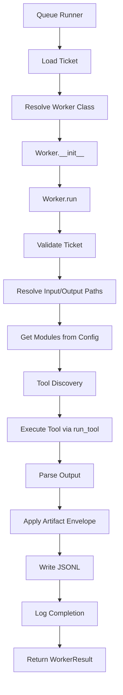

# WADE Workers Framework

The **Workers Framework** provides a unified execution engine for forensic tools. Each worker implements a standardized interface, uses shared utilities for tool discovery/execution, produces normalized JSONL output, and logs structured events.

---

## 🎯 Overview

Workers are the execution layer of WADE. They:
1. **Receive** tickets from the queue with metadata and configuration
2. **Validate** input files and ticket integrity
3. **Execute** forensic tools (Volatility, Dissect, Hayabusa, etc.)
4. **Parse** tool output into structured records
5. **Enrich** each record with ticket metadata (artifact envelope)
6. **Write** JSONL output to organized paths
7. **Log** completion events with record counts and duration

---

## 🏗️ Architecture



* * * * *

📂 Module Structure
-------------------

```
wade_workers/
├── bin/
│   ├── wade_queue_runner.py        # Main dispatcher
│   └── validate_tickets.py         # Ticket validation utility
├── wade_workers/
│   ├── __init__.py
│   ├── cli.py                      # Worker CLI entry point
│   ├── base_worker.py              # BaseWorker abstract class
│   │
│   ├── # Core Workers
│   ├── volatility_worker.py        # Memory analysis
│   ├── dissect_worker.py           # Disk/image parsing
│   ├── hayabusa_worker.py          # Windows event logs
│   ├── plaso_worker.py             # Timeline generation
│   ├── yara_worker.py              # Malware/IOC scanning
│   ├── bulkextractor_worker.py     # Feature extraction
│   │
│   ├── # Shared Utilities
│   ├── hashing.py                  # Multi-strategy content hashing
│   ├── logging.py                  # Unified event logging
│   ├── module_config.py            # YAML+ENV config loader
│   ├── subprocess_utils.py         # Tool discovery & execution
│   ├── ticket_schema.py            # Canonical ticket format
│   └── path_resolver.py            # Output path construction
├── systemd/
│   ├── wade-queue@.service         # Worker dispatcher service
│   └── wade-queue.timer            # Optional timer-based dispatch
└── tests/
    ├── test_workers.py
    ├── test_hashing.py
    ├── test_module_config.py
    └── fixtures/

```

* * * * *

🎫 Ticket Schema (v2.0)
-----------------------

### WorkerTicket Structure

```source-python
@dataclass
class TicketMetadata:
    ticket_id: str
    hostname: str
    classification: str
    os_family: Optional[str]
    os_version: Optional[str]
    source_file: str
    dest_path: str
    file_size_bytes: Optional[int]
    file_hash_sha256: Optional[str]
    case_id: Optional[str]
    case_name: Optional[str]
    analyst: Optional[str]
    created_utc: str
    staged_utc: Optional[str]
    acquired_utc: Optional[str]
    priority: int
    retry_count: int
    tags: List[str]
    custom: Dict[str, Any]

@dataclass
class WorkerTicket:
    metadata: TicketMetadata
    worker_config: Dict[str, Any]  # profile, location, requested_tools
    schema_version: str = "2.0"
```

### Example Ticket

```source-json
{
  "schema_version": "2.0",
  "metadata": {
    "ticket_id": "550e8400-e29b-41d4-a716-446655440000",
    "hostname": "DESKTOP-ABC123",
    "classification": "memory",
    "os_family": "Windows",
    "source_file": "/home/autopsy/Staging/full/memory.dmp",
    "dest_path": "/home/autopsy/DataSources/memory/DESKTOP-ABC123/memory.dmp",
    "file_size_bytes": 4294967296,
    "file_hash_sha256": "abc123...",
    "case_id": "2025-001",
    "analyst": "autopsy",
    "created_utc": "2025-12-16T20:00:00Z",
    "staged_utc": "2025-12-16T20:00:30Z",
    "priority": 5,
    "retry_count": 0,
    "tags": ["malware", "urgent"]
  },
  "worker_config": {
    "profile": "full",
    "location": "datacenterA",
    "requested_tools": ["volatility", "yara_mem"]
  }
}
```

* * * * *

🔧 Shared Utilities
-------------------

### subprocess_utils.py --- Tool Discovery & Execution

Tool Discovery Framework:

```source-python
from wade_workers.subprocess_utils import get_default_registry

# Find tool (checks WADE_<TOOL>_PATH env var, then system PATH)
registry = get_default_registry()
volatility_path = registry.find_tool("volatility")

# Require tool (raises ToolNotFoundError if not found)
volatility_path = registry.require_tool("volatility")
```

Safe Command Execution:

```source-python
from wade_workers.subprocess_utils import run_tool, safe_run

# Run tool with timeout, logging, and error handling
result = run_tool(
    tool_name="volatility",
    args=["--file", str(memory_path), "windows.pslist"],
    timeout=300,
    check=True  # Raise on non-zero exit
)

print(f"Exit code: {result.rc}")
print(f"Duration: {result.duration_sec}s")
print(f"Output: {result.stdout}")
```

CommandResult:

```source-python
@dataclass
class CommandResult:
    cmd: List[str]
    rc: int
    stdout: str
    stderr: str
    duration_sec: float
    timed_out: bool

    @property
    def success(self) -> bool:
        return self.rc == 0 and not self.timed_out
```

### hashing.py --- Content Hashing Strategies

Quick Hash (for deduplication):

```source-python
from wade_workers.hashing import quick_hash, QuickHasher

# Convenience function (4MB head+tail, SHA256)
sha256_digest = quick_hash(file_path)

# Custom sample size
hasher = QuickHasher(sample_bytes=8*1024*1024, algo="sha256")
result = hasher.hash(file_path)
print(f"SHA256: {result['sha256']}")
print(f"Sample size: {result.sample_size} bytes")
```

Forensic Hash (full file, multiple algorithms):

```source-python
from wade_workers.hashing import forensic_hash, FullFileHasher

# Convenience function (MD5, SHA1, SHA256)
hashes = forensic_hash(file_path)
print(f"MD5: {hashes['md5']}")
print(f"SHA1: {hashes['sha1']}")
print(f"SHA256: {hashes['sha256']}")

# Custom algorithms
hasher = FullFileHasher(algos=["sha256", "sha512"])
result = hasher.hash(file_path)
```

Streaming Hash (memory-efficient for large files):

```source-python
from wade_workers.hashing import StreamingHasher

hasher = StreamingHasher(algos=["sha256"], chunk_size=1024*1024)
result = hasher.hash(large_file_path)
```

### logging.py --- Unified Event Logging

Event Logger:

```source-python
from wade_workers.logging import EventLogger

logger = EventLogger.get_logger("volatility_worker")

# Log worker start
logger.log_worker_start(
    tool="volatility",
    module="windows.pslist",
    host="DESKTOP-ABC123"
)

# Log completion
logger.log_worker_complete(
    tool="volatility",
    module="windows.pslist",
    host="DESKTOP-ABC123",
    record_count=127,
    duration_sec=45.2,
    output_path=output_file
)

# Log error
logger.log_worker_error(
    tool="volatility",
    error_msg="Profile detection failed",
    host="DESKTOP-ABC123"
)
```

Artifact Finalization:

```source-python
from wade_workers.logging import finalize_worker_records_with_ticket

# Apply envelope to all records and write JSONL
records = [
    {"PID": 4, "Name": "System", "Threads": 127},
    {"PID": 456, "Name": "explorer.exe", "Threads": 32}
]

count = finalize_worker_records_with_ticket(
    records=records,
    output_path=output_file,
    ticket=worker_ticket,
    tool="volatility",
    module="windows.pslist"
)
print(f"Wrote {count} enriched records")
```

### module_config.py --- Configuration Management

Loading Configuration:

```source-python
from wade_workers.module_config import get_global_config

cfg = get_global_config()

# Get tool-specific config
volatility_config = cfg.get_tool_config("volatility")

# Get modules with environment overrides
modules = cfg.get_modules(
    tool="volatility",
    key="modules",
    default=["windows.info", "windows.pslist"],
    env_var="WADE_VOLATILITY_MODULES"
)
```

Environment Override Syntax:

```source-shell
# Replace mode (no +/- modifiers)
WADE_VOLATILITY_MODULES=windows.info,windows.pslist,windows.netscan

# Incremental mode (add/remove)
WADE_VOLATILITY_MODULES=+windows.malfind,-windows.handles
```

### path_resolver.py --- Output Path Construction

Computing Output Paths:

```source-python
from wade_workers.path_resolver import compute_worker_output_paths

output_dir, output_file = compute_worker_output_paths(
    ticket=worker_ticket,
    tool="volatility",
    module="memory",
    env=os.environ
)

# Result:
# output_dir: /home/autopsy/DataSources/memory/DESKTOP-ABC123/volatility/memory/
# output_file: /home/autopsy/DataSources/memory/DESKTOP-ABC123/volatility/memory/DESKTOP-ABC123_20251216T200530Z.jsonl
```

* * * * *

👷 Worker Implementations
-------------------------

### VolatilityWorker

Purpose: Memory forensics using Volatility3

Modules (default):

-   `windows.info` --- OS and kernel info
-   `windows.pslist` --- Process list
-   `windows.pstree` --- Process tree
-   `windows.cmdline` --- Command-line arguments
-   `windows.netscan` --- Network connections
-   `windows.handles` --- Open handles
-   `windows.dlllist` --- Loaded DLLs
-   `windows.services` --- Windows services
-   `windows.malfind` --- Code injection detection

Configuration:

```source-yaml
# etc/config.yaml
volatility:
  modules:
    - windows.info
    - windows.pslist
    - windows.malfind
  disabled_modules:
    - windows.bigpools  # Too verbose
```

Environment Override:

```source-shell
WADE_VOLATILITY_MODULES=windows.info,windows.pslist,+windows.hollowprocesses
```

Output Example:

```source-json
{
  "tool": "volatility",
  "module": "windows.pslist",
  "host": "DESKTOP-ABC123",
  "case_id": "2025-001",
  "PID": 456,
  "PPID": 4,
  "ImageFileName": "explorer.exe",
  "Offset": "0xffff8a8c12345678",
  "Threads": 32,
  "Handles": 1234,
  "CreateTime": "2025-12-15 18:30:00 UTC"
}
```

### DissectWorker

Purpose: Disk/image parsing using Dissect framework

Modules (default):

-   `filesystem` --- File system artifacts
-   `registry` --- Windows registry
-   `evtx` --- Windows event logs
-   `prefetch` --- Prefetch files
-   `timeline` --- Full timeline

OS-Aware Selection:

-   Windows: All modules
-   Linux: filesystem, timeline (no registry, evtx, prefetch)

Configuration:

```source-yaml
dissect:
  modules:
    - filesystem
    - registry
    - evtx
```

Environment Override:

```source-shell
WADE_DISSECT_MODULES=filesystem,registry,+amcache,-shellbags
```

Workflow:

1.  Run `target-info` to detect OS
2.  Select plugins based on OS family
3.  For each plugin: `target-query -f <plugin>` → `rdump --multi`
4.  Parse JSONL, enrich with envelope, write output

### HayabusaWorker

Purpose: Windows event log threat detection

Input: EVTX files or E01/disk images containing `C:\Windows\System32\WinEvt\Logs`

Workflow:

1.  Detect input type (directory of EVTX, parent dir, or disk image)
2.  If disk image: carve logs with Dissect (`target-query -f evtx`)
3.  Run Hayabusa: `hayabusa-2.x-linux json-timeline --output <temp.jsonl>`
4.  Enrich each record with envelope
5.  Write to final output

Configuration:

```source-yaml
hayabusa:
  output_format: json-timeline  # or csv-timeline, logon-summary
```

Output Example:

```source-json
{
  "tool": "hayabusa",
  "module": "detections",
  "host": "DESKTOP-ABC123",
  "Timestamp": "2025-12-15 18:32:15",
  "EventID": 4688,
  "Computer": "DESKTOP-ABC123",
  "Channel": "Security",
  "Level": "Informational",
  "RuleTitle": "Process Creation",
  "Details": "powershell.exe -enc <base64>",
  "MitreTactics": "Execution",
  "MitreTags": "T1059.001"
}
```

### PlasoWorker

Purpose: Timeline generation using log2timeline/Plaso

Workflow:

1.  Run `log2timeline.py` to create Plaso storage (.plaso)
2.  Run `psort.py` with output modules (json_line, elastic, etc.)
3.  Stream each line through envelope
4.  Write per-module JSONL

Configuration:

```source-yaml
plaso:
  output_modules:
    - json_line
  # Options: dynamic, json, json_line, xlsx, elastic, opensearch
```

Environment Override:

```source-shell
WADE_PLASO_OUTPUT_MODULES=json_line,elastic
```

### YaraWorker

Purpose: YARA rule scanning

Modes:

-   Disk scan: Scan files on disk/image
-   Memory scan: Scan memory dumps (alias: `yara_mem`)

Configuration:

```source-yaml
yara:
  rules_dir: /opt/wade/yara
  additional_rules:
    - /opt/custom_rules
```

Workflow:

1.  Load compiled rules or compile from source
2.  Run `yara --json <rules> <target>`
3.  Parse JSON output (per-match records)
4.  Enrich with envelope
5.  Write JSONL

Output Example:

```source-json
{
  "tool": "yara",
  "module": "scan",
  "host": "DESKTOP-ABC123",
  "rule": "Trojan_Emotet",
  "namespace": "malware",
  "tags": ["trojan", "emotet"],
  "matches": [
    {"offset": 12345, "data": "base64encodedmatch"}
  ],
  "meta": {
    "author": "DFIR Team",
    "description": "Emotet banking trojan"
  }
}
```

### BulkExtractorWorker

Purpose: Extract features (emails, URLs, credit cards, phone numbers)

Scanners (default):

-   `email` --- Email addresses
-   `url` --- URLs
-   `ccn` --- Credit card numbers
-   `telephone` --- Phone numbers
-   `base64` --- Base64-encoded strings

Configuration:

```source-yaml
bulk_extractor:
  scanners:
    - email
    - url
    - ccn
  disabled_scanners:
    - exif  # Can be noisy
```

Workflow:

1.  Run `bulk_extractor` with enabled scanners
2.  Parse feature.txt files (email.txt, url.txt, etc.)
3.  Enrich each feature with envelope and feature_type
4.  Write consolidated JSONL

* * * * *

🚀 Queue Runner
---------------

### wade_queue_runner.py

Purpose: Dispatch tickets to workers

Usage:

```source-shell
# Manual dispatch
/opt/wade/wade_workers/bin/wade_queue_runner.py /path/to/ticket.json

# Via systemd
sudo systemctl start wade-queue@autopsy.service
```

Dispatch Flow:

```source-python
def dispatch_ticket(ticket_path: Path, env: Optional[dict] = None) -> int:
    # 1. Load ticket
    ticket = WorkerTicket.load(ticket_path)

    # 2. Get requested tools
    tools = ticket.worker_config.get("requested_tools", [])

    # 3. For each tool:
    for tool_name in tools:
        # Resolve worker (handle aliases: yara_mem → YaraWorker)
        worker_class = resolve_worker(tool_name)

        # Merge per-tool overrides into ticket config
        merge_tool_overrides(ticket, tool_name)

        # Execute worker
        worker = worker_class(env=env)
        result = worker.run(ticket.to_dict())

        # Log result
        log_worker_result(tool_name, result)

    # 4. Return composite exit code
    return 0 if all_succeeded else 1
```

Worker Map:

```source-python
WORKER_MAP = {
    "volatility": ("volatility_worker", "VolatilityWorker"),
    "dissect": ("dissect_worker", "DissectWorker"),
    "hayabusa": ("hayabusa_worker", "HayabusaWorker"),
    "plaso": ("plaso_worker", "PlasoWorker"),
    "yara": ("yara_worker", "YaraWorker"),
    "bulk_extractor": ("bulkextractor_worker", "BulkExtractorWorker"),
}

# Aliases
"yara_mem": maps to YaraWorker with mode=memory override
```

* * * * *

⚙️ Configuration
----------------

### Environment Variables

Worker Runtime:

```source-shell
WADE_DATADIR=/home/autopsy/DataSources
WADE_LOG_DIR=/var/wade/logs
WADE_CONFIG_PATH=/etc/wade/config.yaml
```

Tool Paths (auto-detected if not set):

```source-shell
WADE_VOLATILITY_PATH=/opt/volatility3/vol.py
WADE_DISSECT_TARGET_INFO_PATH=/usr/local/bin/target-info
WADE_HAYABUSA_PATH=/opt/hayabusa/hayabusa
WADE_PLASO_LOG2TIMELINE_PATH=/usr/bin/log2timeline.py
WADE_PLASO_PSORT_PATH=/usr/bin/psort.py
WADE_YARA_PATH=/usr/bin/yara
WADE_BULK_EXTRACTOR_PATH=/usr/bin/bulk_extractor
```

Per-Tool Modules:

```source-shell
WADE_VOLATILITY_MODULES=windows.info,windows.pslist,+windows.malfind
WADE_DISSECT_MODULES=filesystem,registry,+evtx
WADE_PLASO_OUTPUT_MODULES=json_line
WADE_BULK_EXTRACTOR_SCANNERS=email,url,ccn
```

### YAML Configuration

```source-yaml
# etc/config.yaml
volatility:
  modules:
    - windows.info
    - windows.pslist
    - windows.malfind
  disabled_modules: []

dissect:
  modules:
    - filesystem
    - registry
    - evtx

hayabusa:
  output_format: json-timeline

plaso:
  output_modules:
    - json_line

bulk_extractor:
  scanners:
    - email
    - url
    - ccn
```

* * * * *

📊 Output Format
----------------

### Artifact Envelope

Every record includes enrichment metadata:

```source-json
{
  "tool": "volatility",
  "module": "windows.pslist",
  "host": "DESKTOP-ABC123",
  "case_id": "2025-001",
  "case_name": "Ransomware Investigation",
  "os_family": "Windows",
  "source_file": "/home/autopsy/Staging/full/memory.dmp",
  "dest_path": "/home/autopsy/DataSources/memory/DESKTOP-ABC123/memory.dmp",
  "collected_utc": "2025-12-15T18:30:00Z",
  "staged_utc": "2025-12-16T20:00:00Z",
  "processed_utc": "2025-12-16T20:05:00Z",
  "analyst": "autopsy",
  ...original tool output fields...
}
```

### Output Path Convention

```
DataSources/
└── <sourcetype>/              # e.g., "memory", "e01", "disk"
    └── <hostname>/
        └── <tool>/
            └── <module>/
                └── <hostname>_<timestamp_utc>.jsonl

```

Example:

```
/home/autopsy/DataSources/memory/DESKTOP-ABC123/volatility/memory/DESKTOP-ABC123_20251216T200530Z_pslist.jsonl

```

* * * * *

🛠️ Troubleshooting
-------------------

### Worker Execution Failures

```source-shell
# Check tool availability
which volatility ewfinfo target-info hayabusa

# Test tool discovery
python3 -c "
from wade_workers.subprocess_utils import get_default_registry
reg = get_default_registry()
print('Volatility:', reg.find_tool('volatility'))
"

# Manual worker execution with verbose output
python3 -m wade_workers.cli\
  --worker volatility\
  --ticket /path/to/ticket.json\
  --verbose
```

### Module Selection Issues

```source-shell
# Verify config loading
python3 -c "
from wade_workers.module_config import get_global_config
cfg = get_global_config()
print('Volatility modules:', cfg.get_modules('volatility', 'modules'))
"

# Test environment override
WADE_VOLATILITY_MODULES=windows.info,windows.pslist python3 -c "
from wade_workers.module_config import get_global_config
cfg = get_global_config()
print('Modules:', cfg.get_modules('volatility', 'modules', env_var='WADE_VOLATILITY_MODULES'))
"
```

### Output Path Issues

```source-shell
# Verify path construction
python3 -c "
from pathlib import Path
from wade_workers.ticket_schema import WorkerTicket
from wade_workers.path_resolver import compute_worker_output_paths

ticket = WorkerTicket.load(Path('/path/to/ticket.json'))
output_dir, output_file = compute_worker_output_paths(ticket, 'volatility', 'memory')
print(f'Output dir: {output_dir}')
print(f'Output file: {output_file}')
"
```

* * * * *

🧪 Testing
----------

```source-shell
# Run all worker tests
pytest wade_workers/tests/ -v

# Test specific worker
pytest wade_workers/tests/test_volatility_worker.py -v

# Test shared utilities
pytest wade_workers/tests/test_hashing.py -v
pytest wade_workers/tests/test_subprocess_utils.py -v
pytest wade_workers/tests/test_module_config.py -v

# Integration tests (requires fixtures)
pytest wade_workers/tests/test_integration.py -v
```

* * * * *

For more information:

-   [Main README](https://github.com/imcconnell15/WADE/README.md)
-   [Staging Documentation](https://github.com/imcconnell15/WADE/staging/README.md)
-   [Configuration Guide](https://github.com/imcconnell15/WADE/etc/README.md)
